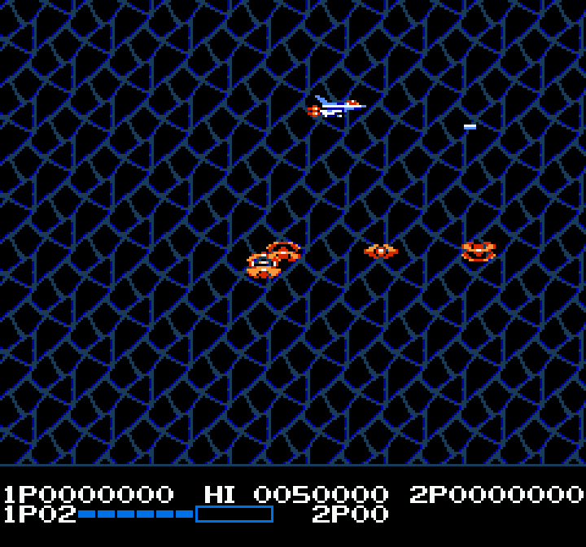

# RL Life Force (Salamander) — NES

Reinforcement learning on **Life Force** (the NES release of Konami's
*Salamander*), using [stable-retro](https://github.com/Farama-Foundation/stable-retro)
+ [Stable-Baselines3](https://github.com/DLR-RM/stable-baselines3) PPO.



**Goal:** train an agent to clear **Level 1**, with the project structured so
later levels are a config change rather than a rewrite.

Why this project exists: most RL game tutorials use turnkey packages (like
`gym-super-mario-bros`) that bundle the ROM, the action set, and the reward
signal. This one tackles the part those skip — doing RL on a game through a
**generic** emulator framework: building stable-retro from source, bringing your
own ROM, and extending the game integration (finding RAM addresses) yourself.

---

## Status

- ✅ **Feasibility** — stable-retro builds natively on Apple Silicon; runs Life
  Force Level 1 end-to-end. See [`docs/macos_arm64_build.md`](docs/macos_arm64_build.md).
- ✅ **RAM map** — lives/score/position, auto-scroll clock, and the full power-up
  state (meter, speed, options, missile, shield). See [`docs/ram_map.md`](docs/ram_map.md).
- ✅ **Training pipeline** — env factory (MultiDiscrete actions; survival + score
  + power-up reward shaping), PPO with stability fixes (`target_kl`, LR annealing,
  reward normalization), TensorBoard metrics, and a live/video player.
- ✅ **Save-state curriculum** — capture a hard spot, auto-mix it into training.
- 🔜 **Clearing Level 1** — the agent reliably reaches a mid-stage terrain
  "gauntlet" but doesn't yet thread it; iterating on curriculum, loadout
  (no speed), and exploration. (The bundled 10M-step benchmark never cleanly
  cleared either — this is hard.)

## Docs

- **[`docs/devlog.md`](docs/devlog.md)** — decisions, lessons, and current state.
  **Read this to pick up the project cold:** why things are the way they are, what
  we tried, where we're stuck, and what to try next.
- **[`docs/ram_map.md`](docs/ram_map.md)** — the game's RAM addresses we use
  (score, lives, position, power-up state) and how we found them.
- **[`docs/macos_arm64_build.md`](docs/macos_arm64_build.md)** — building
  stable-retro on Apple Silicon: the three non-obvious blockers (mislabeled wheel,
  removed Homebrew formula, clang vs the old cores) and the fixes.

## Quickstart

### 1. Install (Apple Silicon / macOS)

There is **no working prebuilt stable-retro wheel on Apple Silicon** — the
published one is a mislabeled x86_64 binary. Our script builds it natively from
source (NES core only). Full explanation: [`docs/macos_arm64_build.md`](docs/macos_arm64_build.md).

```bash
python -m venv .venv && source .venv/bin/activate
pip install -r requirements.txt
./scripts/setup_stable_retro.sh        # builds stable-retro from source
```

(On Linux, `pip install stable-retro` works directly.)

### 2. Bring your own ROM

This repo does **not** include the ROM — Life Force is copyrighted. Supply your
own legally-owned dump and import it:

```bash
python -m retro.import /path/to/your/roms/
```

stable-retro identifies the ROM by the SHA-1 of its *headerless* data
(`351edb1fdf4bce3bfc56d1eecccfdc6a21bb14f4`). Note this differs from
`shasum` of the `.nes` file, which includes the 16-byte iNES header.

### 3. Verify

```bash
python -c "import stable_retro as retro; env = retro.make('LifeForce-Nes-v0', state='1Player.Level1'); print(env.reset()[0].shape); env.close()"
```

## Usage

All commands assume the venv is active (`source .venv/bin/activate`) and your ROM
is imported. For long/overnight runs, prefix with **`caffeinate -is`** so macOS
sleep doesn't pause training. `<run>` below = a folder under `checkpoints/`.

### 1. Train from scratch
```bash
python -m src.train --run-name my-run     # fresh run -> checkpoints/my-run/
python -m src.train --smoke               # ~30s end-to-end sanity check first
```
Runs `N_ENVS=8` emulators in parallel. Each run gets its own
`checkpoints/<run-name>/` (a timestamp if `--run-name` is omitted) and a matching
TensorBoard run, so runs never overwrite each other.

### 2. Resume from a checkpoint
```bash
python -m src.train --resume checkpoints/<run>/lifeforce_ppo_<N>_steps.zip --run-name my-run-v2
```
Loads the policy **and** that run's `vecnormalize.pkl`. The continuation gets a
new folder (SB3 resets the step counter on resume — that's why per-run folders
matter). Reward/PPO changes in `config.py` apply on resume; action-space/
`FRAME_SIZE` changes do **not** (those need a fresh train).

### 3. Curriculum — drill a hard spot, then train
```bash
# capture where the agent gets stuck (its death point; --before-death = lead-in):
python -m tools.capture_state --model checkpoints/<run>/lifeforce_ppo_<N>_steps.zip \
  --name l1_gauntlet --before-death 120
# resume — every *.state in states/ auto-mixes into ~CURRICULUM_MIX of episodes:
python -m src.train --resume checkpoints/<run>/lifeforce_ppo_<N>_steps.zip --run-name l1-drill
```
Drop a `.state` in `states/` to add a drill point, delete it to remove one; an
**empty `states/` = curriculum off** (100% level start). The real level start is
always kept, so the agent still learns the whole stage. (Save states embed
ROM-derived data → `states/` is gitignored; regenerate with the capture tool.)

### 4. Play / watch
```bash
# from the level start — default is a live 3x window with sound:
python -m src.play --model checkpoints/<run>/lifeforce_ppo_final.zip
# from a saved state (e.g. a captured wall):
python -m src.play --model checkpoints/<run>/lifeforce_ppo_final.zip --from-state states/l1_gauntlet.state
```
Useful flags: `--deterministic` (greedy/argmax — shows the agent's "best intended"
play; default is stochastic sampling), `--no-audio`, `--scale N` (window size),
`--render video` (record `videos/play.mp4` instead of a live window; keeps sound).
Stop training first for smooth live audio.

### 5. Monitor (TensorBoard)
```bash
tensorboard --logdir tb_logs    # http://localhost:6006
```
**The key chart is `lifeforce/best_score`** — the absolute score reached; it
crossing a plateau = a real breakthrough. Also `lifeforce/clear_rate` and the
`reward/*` breakdown. **Caveat:** with curriculum on, `reward/*` averages are
*diluted* by wall-start episodes — judge progress by `lifeforce/best_score`, not
the reward averages.

### Tuning
Most knobs live in [`src/config.py`](src/config.py): reward weights (`REWARD_*`),
`CURRICULUM_MIX`, PPO hyperparameters, `FRAME_SIZE`. Handy CLI overrides:
`--ent-coef` (raise it, e.g. `0.03`, for more exploration to break a plateau),
`--save-freq`, `--timesteps`, `--device`.

## How it works (design)

**Training:** PPO (`CnnPolicy` / NatureCNN) on **16 parallel emulators**
(`SubprocVecEnv` — stable-retro allows only one emulator per process) for
decorrelated experience. **Train on the GPU (MPS) on Apple Silicon** — profiling
(`tools/bench.py`) shows the gradient/learn phase, which is ~85% of CPU wall-clock,
runs far faster on MPS (**~2.5×** end-to-end). `--device auto` picks MPS here. On
MPS the bottleneck then shifts to *per-step policy inference* (CPU↔GPU transfer),
so raising **`N_ENVS`** amortizes it over a bigger batch and scales throughput
further (8→16 ≈ 1.5×, up to ~2.2× at 32) — combined ~5× over the CPU baseline. See
[`docs/devlog.md`](docs/devlog.md) for the full profile.

**Reward:** **survival is #1**, enforced by ending the episode on death (dying
forfeits all remaining reward) rather than a large idle bonus — so the agent
stays alive *in order to* **score** (the main positive signal). A **clear bonus**
rewards reaching Stage 2 (and auto-captures the Stage-2 RAM).

**Action space:** `MultiDiscrete([9, 2])` — two independent choices: **movement**
(9 options, fire `B` always on since shooting is never worse) and **activate a
power-up** (`A`) or not. Factoring lets the agent activate *while* moving and is
more sample-efficient than a flat 18-action set.

**Power-ups** (the Gradius meter): bonuses for acquiring upgrades, prioritized
**Missile > Option > Force Field**, with **Speed thresholded** — a little (≤
`MAX_SPEED`) helps dodging and earns a small bonus, but each level *beyond* it is
heavily penalized (too much speed makes the ship overshoot in tight terrain).
Rewarding *state increases* means upgrade caps self-enforce. Shows as
`reward/powerup`.

## Licensing

- This project's code: MIT (see `LICENSE`).
- stable-retro: MIT. The NES core it builds (`fceumm`): **GPLv2** — which is why
  we ship a build *script*, not a prebuilt binary.
- ROMs: not included, not redistributable. Bring your own.
