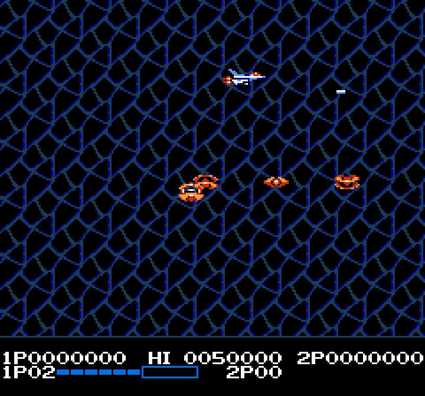

# RL Life Force (Salamander) — NES

Reinforcement learning on **Life Force** (the NES release of Konami's
*Salamander*), using [stable-retro](https://github.com/Farama-Foundation/stable-retro)
+ [Stable-Baselines3](https://github.com/DLR-RM/stable-baselines3) PPO.



**Result:** the agent clears **Level 1** deterministically in 3642 agent steps.
A separate Level-2 specialist now reaches 4342 steps from the settled
vertical-stage reset, up from the inherited policy's 233-step baseline.

Why this project exists: most RL game tutorials use turnkey packages (like
`gym-super-mario-bros`) that bundle the ROM, the action set, and the reward
signal. This one tackles the part those skip — doing RL on a game through a
**generic** emulator framework: building stable-retro from source, bringing your
own ROM, and extending the game integration (finding RAM addresses) yourself.

---

## Status

- ✅ **Feasibility** — stable-retro builds natively on Apple Silicon; runs Life
  Force Level 1 end-to-end. See [`docs/macos_arm64_build.md`](docs/macos_arm64_build.md).
- ✅ **RAM map** — lives/score/position, auto-scroll clock, and the full power-up
  state (meter, speed, options, missile, shield). See [`docs/ram_map.md`](docs/ram_map.md).
- ✅ **Training pipeline** — env factory (MultiDiscrete actions; survival + score
  + power-up reward shaping), PPO with stability fixes (`target_kl`, LR annealing,
  reward normalization), TensorBoard metrics, and a live/video player.
- ✅ **Optional save-state curriculum** — retained for broad, noise-tolerant
  recovery skills; canonical reset search is the default for precision hazards.
- ✅ **Canonical search + imitation loop** — search from the true reset
  trajectory, record the full golden run, then behavior-clone it back into the
  policy (see [Training strategy](#training-strategy-ppo-bootstrap-and-canonical-golden-runs)).
  Survival from the level start: **891 steps → a 3642-step Level-1 clear**.
- ✅ **Anti-jitter ("calm") recipe** — measured the policy vibrating (64% of
  steps change movement direction); added movement/churn reward penalties and
  HOLD to the search vocabulary. The first calm policy reduced churn 64→41%;
  the final clear policy reaches **19% churn / 62.9% HOLD**.
- ✅ **Level 1 cleared** — the
  [release checkpoint](https://github.com/hefeicoder/rl_lifeforce/releases/download/level1-clear-v1/lifeforce_ppo_bc5_lr1e4.zip)
  clears deterministically in **3642 steps / score 2932**, verified 3/3 from a
  cold level reset. [Proof video](https://github.com/hefeicoder/rl_lifeforce/releases/download/level1-clear-v1/l3_level1_clear.mp4).
- 🚧 **Level 2 specialist bootstrapped** — captured a settled, player-active
  Level-2 reset from the real Level-1 transition, measured the inherited policy
  at 233 steps, and advanced the specialist through canonical golden runs to
  the second boss phase at **4342 steps**, identical in 3/3 resets. The checkpoint is a local working
  milestone, not a released clear artifact; see the
  [Level-2 playbook](docs/level2_training_playbook.md#current-level-2-bootstrap-status-2026-08-16).

### Verified Level-1 artifact

The final checkpoint is a 58 MB generated binary and remains outside normal Git
history (like all training outputs). Download it from the
[Level 1 Clear v1 release](https://github.com/hefeicoder/rl_lifeforce/releases/tag/level1-clear-v1)
into this local path:

```text
checkpoints/l3-level1-clear/lifeforce_ppo_bc5_lr1e4.zip
SHA-256 4b06e817640cfaaa0e2af2f5418f9cd16e75d20e5332cd654889eca61df6aac2
```

Direct downloads:

- [Checkpoint](https://github.com/hefeicoder/rl_lifeforce/releases/download/level1-clear-v1/lifeforce_ppo_bc5_lr1e4.zip)
- [Proof video](https://github.com/hefeicoder/rl_lifeforce/releases/download/level1-clear-v1/l3_level1_clear.mp4)

## Docs

- **[`RESUME.md`](RESUME.md)** — authoritative current handoff: the complete
  milestone history, final checkpoint, verified clear, and next steps.
- **[`docs/level2_training_playbook.md`](docs/level2_training_playbook.md)** —
  operational Level-2 plan: vertical-stage assumptions, strategy decision guide,
  canonical golden-run loop, and acceptance gates.
- **[`docs/go-explore-l3-progress.md`](docs/go-explore-l3-progress.md)** — detailed
  historical experiments and measured failure modes through the anti-jitter era.
- **[`docs/devlog.md`](docs/devlog.md)** — early pipeline/reward/curriculum design
  history. It is historical, not the current status page.
- **[`docs/ram_map.md`](docs/ram_map.md)** — the game's RAM addresses we use
  (score, lives, position, power-up state) and how we found them.
- **[`docs/macos_arm64_build.md`](docs/macos_arm64_build.md)** — building
  stable-retro on Apple Silicon: the three non-obvious blockers (mislabeled wheel,
  removed Homebrew formula, clang vs the old cores) and the fixes.

## Quickstart

### 1. Install (Apple Silicon / macOS)

There is **no working prebuilt stable-retro wheel on Apple Silicon** — the
published one is a mislabeled x86_64 binary. Our script builds it natively from
source (NES core only). Full explanation: [`docs/macos_arm64_build.md`](docs/macos_arm64_build.md).

```bash
python -m venv .venv && source .venv/bin/activate
pip install -r requirements.txt
./scripts/setup_stable_retro.sh        # builds stable-retro from source
```

(On Linux, `pip install stable-retro` works directly.)

### 2. Bring your own ROM

This repo does **not** include the ROM — Life Force is copyrighted. Supply your
own legally-owned dump and import it:

```bash
python -m retro.import /path/to/your/roms/
```

stable-retro identifies the ROM by the SHA-1 of its *headerless* data
(`351edb1fdf4bce3bfc56d1eecccfdc6a21bb14f4`). Note this differs from
`shasum` of the `.nes` file, which includes the 16-byte iNES header.

### 3. Verify

```bash
python -c "import stable_retro as retro; env = retro.make('LifeForce-Nes-v0', state='1Player.Level1'); print(env.reset()[0].shape); env.close()"
```

## Usage

All commands assume the venv is active (`source .venv/bin/activate`) and your ROM
is imported. The integration starts at Level 1 by default; `--initial-state`
selects a settled later-stage state as the real reset target. Before Level-2
training or canonical search, capture that state as described in the
[`Level-2 training playbook`](docs/level2_training_playbook.md). For long runs,
prefix with `caffeinate -is` so macOS sleep does not pause training.

### 1. Download and evaluate the released checkpoint

```bash
mkdir -p checkpoints/l3-level1-clear
curl -L \
  https://github.com/hefeicoder/rl_lifeforce/releases/download/level1-clear-v1/lifeforce_ppo_bc5_lr1e4.zip \
  -o checkpoints/l3-level1-clear/lifeforce_ppo_bc5_lr1e4.zip

shasum -a 256 checkpoints/l3-level1-clear/lifeforce_ppo_bc5_lr1e4.zip

# Cold deterministic evaluation from the integration's real reset:
python -m src.play \
  --model checkpoints/l3-level1-clear/lifeforce_ppo_bc5_lr1e4.zip \
  --deterministic --episodes 3

# Record a proof/diagnostic video instead of opening the live window:
python -m src.play \
  --model checkpoints/l3-level1-clear/lifeforce_ppo_bc5_lr1e4.zip \
  --deterministic --episodes 1 --render video --out videos/eval.mp4
```

The expected checkpoint SHA-256 is
`4b06e817640cfaaa0e2af2f5418f9cd16e75d20e5332cd654889eca61df6aac2`.
Playback defaults to a live 3× window with sound. Useful flags include
`--no-audio`, `--scale N`, and `--aspect 0`. `--from-state` is useful for a
diagnostic probe, but a loaded state is not evidence of canonical full-run
transfer.

### 2. Capture the next stage's canonical reset

The released Level-1 policy can create the local, gitignored Level-2 start state
directly from its verified transition:

```bash
python -m tools.capture_stage_start \
  --model checkpoints/l3-level1-clear/lifeforce_ppo_bc5_lr1e4.zip \
  --out states/l2_start.state --ram-out ram_dumps/l2_start_ram.npz

# Verify the inherited policy from the settled, player-active Level-2 reset:
python -m src.play \
  --model checkpoints/l3-level1-clear/lifeforce_ppo_bc5_lr1e4.zip \
  --initial-state states/l2_start.state --deterministic --episodes 3
```

The tool detects the real stage transition, waits through the fly-in until player
control and lives are stable, and then saves the emulator state. This is the
canonical reset for the standalone Level-2 specialist; the eventual continuous
Level-1→2 model-switch handoff still needs its own validation.

### 3. PPO bootstrap or broad adaptation

Use PPO for generally weak play or a new mechanic, not as the automatic response
to one precise, repeatable death.

```bash
# End-to-end sanity check, forced to the real reset even if states/ is populated:
python -m src.train --smoke --curriculum-mix 0

# Fresh PPO policy:
python -m src.train --run-name my-bootstrap --curriculum-mix 0

# Continue an existing policy in a new output folder:
python -m src.train \
  --resume checkpoints/<run>/lifeforce_ppo_<N>_steps.zip \
  --run-name my-adaptation --timesteps 250000 --curriculum-mix 0
```

Training uses 16 emulator processes and `--device auto` selects MPS on Apple
Silicon. Every run gets its own `checkpoints/<run-name>/` and TensorBoard folder.
On resume, matching `VecNormalize` statistics are loaded when present beside the
checkpoint; otherwise reward normalization starts fresh. Reward/PPO overrides can
change on resume, but the action space and `FRAME_SIZE` require a fresh policy.

For the vertical Level-2 baseline, disable the old horizontal positioning terms:

```bash
python -m src.train \
  --resume checkpoints/<level2-base>.zip --run-name l2-adaptation \
  --initial-state states/l2_start.state \
  --timesteps 250000 --curriculum-mix 0 \
  --reward-xpos 0 --reward-xmax 0
```

### 4. Advance a localized frontier: canonical search and golden BC

Search from the real reset trajectory, record the entire winning continuation,
then clone it into the policy that generated it:

```bash
python -m tools.segment_search \
  --model checkpoints/<current-best>.zip \
  --initial-state states/l2_start.state \
  --state RESET --warmup <steps-before-hazard> --name next_frontier \
  --beam 8 --rounds 20 --moves 0 1 2 3 4 5 6 7 8 \
  --durations 2 4 8 16 --continuation 800 \
  --script-cap <warmup-plus-budget> \
  --record-continuation --workers 4

python -m tools.self_imitation \
  --model checkpoints/<current-best>.zip \
  --demos demos/next_frontier.npz \
  --out checkpoints/next/lifeforce_ppo_bc.zip \
  --epochs 5 --lr 1e-4

# Accept only a gain reproduced from the real reset:
python -m src.play \
  --model checkpoints/next/lifeforce_ppo_bc.zip \
  --initial-state states/l2_start.state --deterministic --episodes 3
```

`segment_search` requires 2/2 replay before saving a winner. `--script-cap`
includes the warmup. Do not use `--greedy-move`; do not substitute a reloaded
save state for `RESET + warmup` when the maneuver must transfer to the full run.
Evaluate the BC checkpoint before deciding whether any PPO robustness pass is
needed.

### 5. Optional save-state curriculum

Curriculum is now a conditional tool for broad, noise-tolerant recovery skills,
not the default frontier loop:

```bash
python -m tools.capture_state \
  --model checkpoints/<run>/lifeforce_ppo_<N>_steps.zip \
  --initial-state states/l2_start.state \
  --name recovery_leadin --before-death 120

python -m src.train \
  --resume checkpoints/<run>/lifeforce_ppo_<N>_steps.zip \
  --initial-state states/l2_start.state --run-name recovery-drill \
  --curriculum-glob states/recovery_leadin.state --curriculum-mix 0.3
```

Saved states embed ROM-derived data and are gitignored. Cold frame stacks and
emulator-phase differences can make precision skills fail after reload, so every
curriculum result still needs a full cold-reset evaluation. Use
`--curriculum-mix 0` to guarantee curriculum is off even if `states/` contains
old captures.

### 6. Monitor and tune

```bash
tensorboard --logdir tb_logs    # http://localhost:6006
python -m src.train --help
python -m tools.segment_search --help
```

The primary training charts are `lifeforce/recent_best_steps` for current
single-life progress, `lifeforce/best_steps` for the all-time envelope, and
`lifeforce/clear_rate` for the goal. Score is secondary because farming and route
choice can change it without advancing the stage. During curriculum runs, also
watch `curr/recent_best_steps`; `reward/*` averages combine episodes from different
start states and are not a full-level acceptance test.

Most defaults live in [`src/config.py`](src/config.py). Prefer explicit CLI
overrides for experiments, name every output run, sweep intermediate checkpoints,
and preserve the current deterministic best before PPO or BC.

## Training strategy: PPO bootstrap and canonical golden runs

PPO built the general game-playing policy, but PPO alone plateaued on long,
precise corridors. The final solution separates discovery from learning, after
[Go-Explore](https://arxiv.org/abs/1901.10995): deterministic search discovers a
maneuver, then behavior cloning writes the verified continuous trajectory back
into the same policy.

The current loop is:

1. **Evaluate from the real level reset.** Life Force auto-scrolls, so survival
   steps are the terrain-progress metric until the boss. The environment ceiling
   is 7000; `segment_search` aborts if a baseline is truncated so a time limit
   cannot masquerade as a death again.
2. **Search in the canonical world.** Use `--state RESET --warmup N`, never an
   intermediate emulator save, for a maneuver that must transfer to the full run.
   Reloaded states were measured to enter a different frame phase and produced
   late-game scripts that did not transfer.
3. **Record the entire winning trajectory.** `--record-continuation` saves the
   warm level-start prefix, scripted correction, and greedy continuation as one
   observation/action dataset. Winners are independently reproduced twice before
   being saved.
4. **Clone back into the generating policy.** Start with 5 epochs at `--lr
   1e-4`; increase epochs before increasing the learning rate. Larger updates
   distorted otherwise-good boss trajectories.
5. **Crown only a cold-reset result.** A lower offline loss or a save-state probe
   is not enough. The final policy must reproduce the gain from `env.reset()`.

The runnable commands live in [Usage](#4-advance-a-localized-frontier-canonical-search-and-golden-bc).
Cached warmup actions and fast prefix replay keep every candidate in the real
reset world while avoiding redundant CNN/image preprocessing; `--workers`
scores independent candidates in parallel.

### What each stage contributes

| Stage | Gradient source | Role |
|---|---|---|
| PPO bootstrap | reward | learns shooting, navigation, farming, and general recovery |
| Canonical search | none | finds a verified action sequence in the true level-start frame phase |
| Golden recording | none | turns the complete warm trajectory into supervised data |
| Behavior cloning | action likelihood | implants the maneuver while retaining the rest of the route |
| Optional PPO robustness | reward | may improve stochastic robustness, but can also erase precision skills; never overwrite the deterministic clear |

### Measured lessons that matter

- **HOLD and anti-jitter are load-bearing.** The untreated policy changed
  movement on 64% of steps and held only 7%. The clear policy is 19% churn and
  62.9% HOLD.
- **Loadout matters.** Automatically buying Missile then Option turned late
  channel carving from a plateau into a large search gain.
- **Death means any life decrease.** Score-earned 1UPs previously allowed an
  unarmed respawn tail to inflate progress.
- **Save-state search is diagnostic only late in the level.** Canonical reset +
  warmup is required for transferable demonstrations.
- **Evaluation gates every stage.** Search requires 2/2 replay; cloning requires
  a cold-reset gain; the release checkpoint requires repeated clears.

The full experiment chronology and discarded approaches are preserved in
[`RESUME.md`](RESUME.md) and
[`docs/go-explore-l3-progress.md`](docs/go-explore-l3-progress.md).

## How it works (design)

**Training:** PPO (`CnnPolicy` / NatureCNN) on **16 parallel emulators**
(`SubprocVecEnv` — stable-retro allows only one emulator per process) for
decorrelated experience. **Train on the GPU (MPS) on Apple Silicon** — profiling
(`tools/bench.py`) shows the gradient/learn phase, which is ~85% of CPU wall-clock,
runs far faster on MPS (**~2.5×** end-to-end). `--device auto` picks MPS here. On
MPS the bottleneck then shifts to *per-step policy inference* (CPU↔GPU transfer),
so raising **`N_ENVS`** amortizes it over a bigger batch and scales throughput
further (8→16 ≈ 1.5×, up to ~2.2× at 32) — combined ~5× over the CPU baseline. See
[`docs/devlog.md`](docs/devlog.md) for the full profile.

**Reward:** **survival is #1**, enforced by ending the episode on death (dying
forfeits all remaining reward) rather than a large idle bonus — so the agent
stays alive *in order to* **score** (the main positive signal). A **clear bonus**
rewards reaching Stage 2 (and auto-captures the Stage-2 RAM).

**Action space:** `MultiDiscrete([9, 2])` — two independent choices: **movement**
(9 options, fire `B` always on since shooting is never worse) and **activate a
power-up** (`A`) or not. Factoring lets the agent activate *while* moving and is
more sample-efficient than a flat 18-action set.

**Power-ups** (the Gradius meter): bonuses for acquiring upgrades, prioritized
**Missile > Option > Force Field**, with **Speed thresholded** — a little (≤
`MAX_SPEED`) helps dodging and earns a small bonus, but each level *beyond* it is
heavily penalized (too much speed makes the ship overshoot in tight terrain).
Rewarding *state increases* means upgrade caps self-enforce. Shows as
`reward/powerup`.

## Licensing

- This project's code: MIT (see `LICENSE`).
- stable-retro: MIT. The NES core it builds (`fceumm`): **GPLv2** — which is why
  we ship a build *script*, not a prebuilt binary.
- ROMs: not included, not redistributable. Bring your own.
